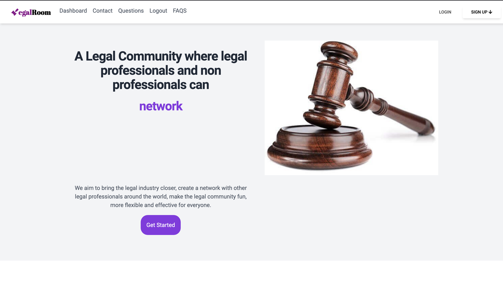
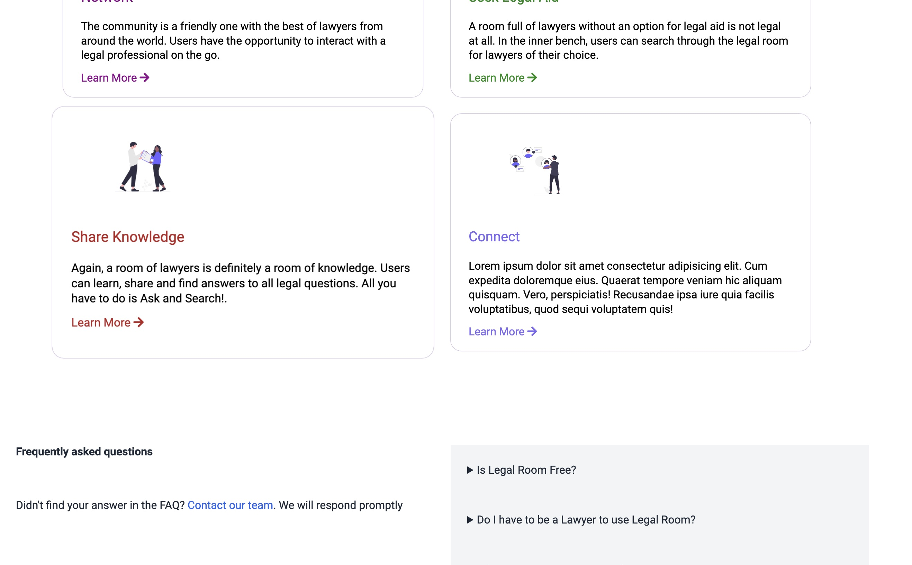
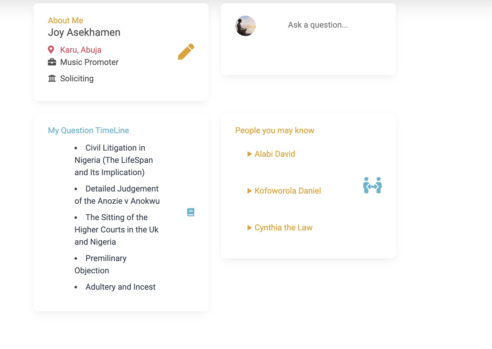
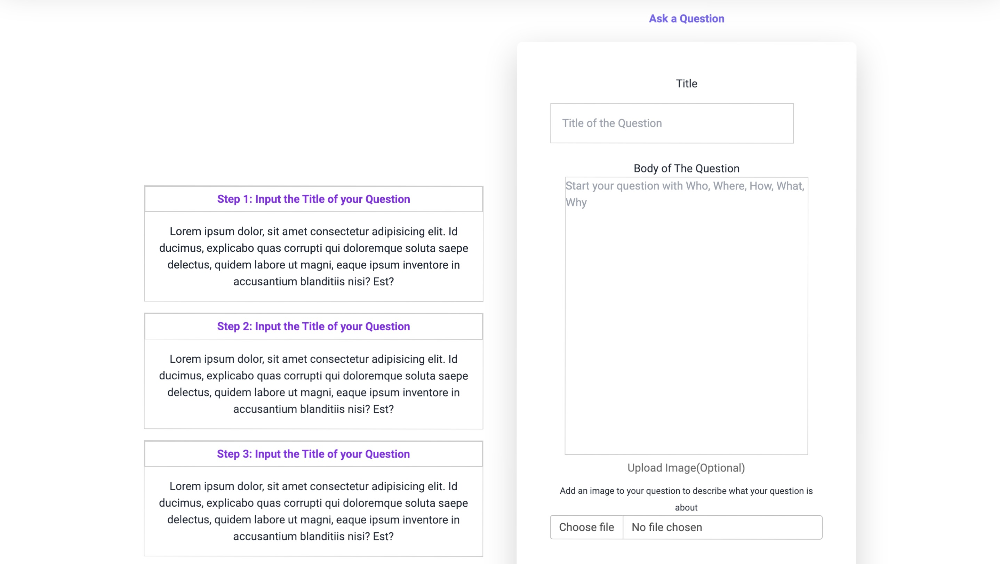

# Legal Room 

The Legal Room Project is a full stack application built with Node js and Express js with data stored in the MongoDB database

[Tap to access the project here](https://legal-room.onrender.com)

### The Process

Tech Used: Ejs, CSS, Tailwind, JavaScript, Bootstrap, MERN stack

This Application is a question and answer forum for legal practitioners. Besides coding, I am a legal professsional and this project was designed to solve one of the issues in the legal industry- an environment where legal and non professionals can seek help and support on legal issues.

## Optimization
Used Tailwind and Bootstrap to improve responsiveness of the application and for better performance. Mongo Database was preferably used to store user and question data because of its high scalability and faster performance compared to other databases.

## Lessons Learned

Understood database and server communication better. 

